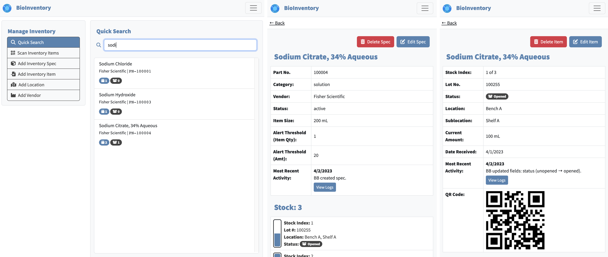

# bio-inventory
Full-stack web application that employs Node.js/Express, Sequelize, and Handlebars to manage consumable inventory in a biomedical lab setting. Users maintian a library of item "specs", from which individual item "instances" can be created and updated as they are used and replenished. 

Key Features: 
- Authenticated logins with multiple privilege levels.
- Generation and scanning of QR codes for inventory items, so that physical items can be paired with their inventory entries.
- Logging for all system changes, enabling easy tracking.
- Flexible, hierarchical location models for easy tracking of items within a workspace.
- Organization of vendor data.

## Usage

### Installation

This app requires Node.js, as well as a running instance of MySQL. To deploy, pull down the repo and provide login credentials for an authorized MySQL user in a `.env` file. Then, start the server with `npm run start`.

### Customization

You must provide a value for `WEB_TITLE` in your `.env` file to properly set the navbar branding and page titles; choose a concise string appropriate for your organization. You must also add a `logo.png` file and `favicon.ico` file to the `/public/images/` directory. Optionally, you may also change the primary UI color by providing hexadecimal strings (e.g. `"#0099FF"`) for the `BRANDING_PRIMARY` and `BRANDING_PRIMARY_HIGHLIGHT` values in your `.env` file.

### Deployed Example

A working, deployed version of the app can be viewed at [https://portfolio.binderlab.io/bio-inventory](https://portfolio.binderlab.io/bio-inventory). Follow the instructions on the login screen to access the guest account.

## Credits

All code for this project was written by the developer.

## License

Please refer to the LICENSE in the repo.
